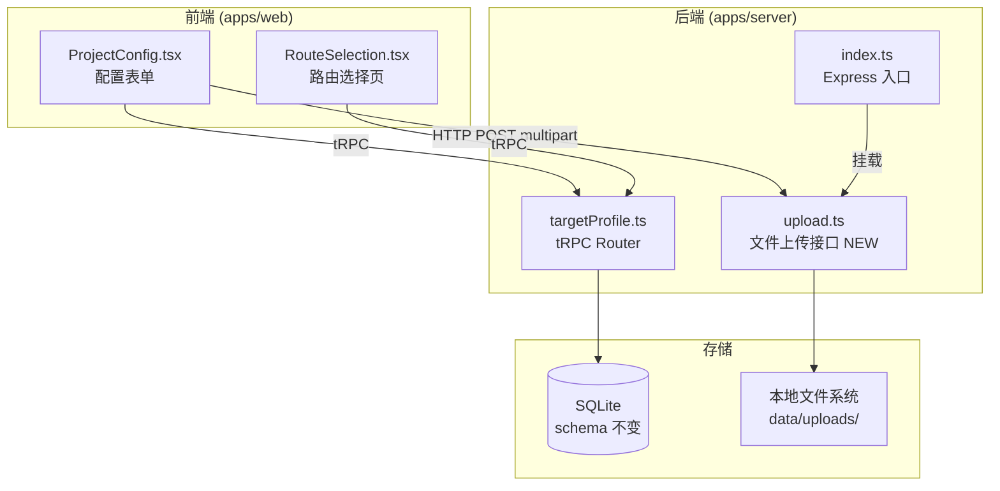

# Design Document: MVP Config Simplify

## Overview

对 smart-test-agent 项目配置页面进行 MVP 简化改造，涉及三个核心变更：

1. **测试路由简化**：多路由 TextArea → 单路由 Input，移除 deniedRoutes
2. **源码配置改为文件上传**：4个路径输入框 → 2个文件上传区域 + 后端上传接口
3. **Schema 校验修复**：loginUrl 放宽校验、deniedRoutes 移除、sourceCodeConfig 结构变更

数据库 schema 保持不变，通过应用层 JSON 序列化兼容。

## Architecture

### 变更范围



### 设计决策

1. **文件上传用 Express REST 接口而非 tRPC**：tRPC 不原生支持 multipart/form-data，使用 multer + Express 路由更简洁
2. **数据库 schema 不变**：allowedRoutes 继续存 JSON 数组（单元素），sourceCodeConfig 存新结构的 JSON，deniedRoutes 存空数组
3. **上传文件按 projectId 隔离**：存储路径为 `data/uploads/{projectId}/route-files/` 和 `data/uploads/{projectId}/page-files/`

## Components and Interfaces

### 1. ProjectConfig.tsx 变更

**测试路由区域**：
- 移除 `<TextArea>` (allowedRoutes)，替换为 `<Input>` (testRoute)
- 移除 deniedRoutes 的 `<TextArea>`
- 提交时将 `testRoute` 包装为 `[testRoute]` 数组
- 加载时从 `allowedRoutes[0]` 回填

**源码配置区域**：
- 移除 4 个路径 Input（frontendRoot, routerFile, pageDir, apiDir）
- 新增"路由/菜单文件"Upload 组件（maxCount: 2）
- 新增"页面组件文件"Upload 组件（支持多文件或 zip）
- 上传成功后记录返回的文件路径，保存时作为 sourceCode 提交

### 2. Upload Endpoint (新增)

**路径**: `POST /api/upload/:projectId`

**请求**: multipart/form-data
- `category` field: `"route"` | `"page"`
- `files` field: 上传的文件（支持多个）

**响应**:
```json
{
  "success": true,
  "files": [
    { "originalName": "routes.ts", "storagePath": "data/uploads/{projectId}/route-files/routes.ts", "size": 1234 }
  ]
}
```

**实现**: 使用 multer 中间件处理文件上传，存储到 `data/uploads/{projectId}/{category}-files/` 目录。

### 3. Backend Router (targetProfile.ts) 变更

**Schema 变更**:
```typescript
// loginUrl: z.string().url() → z.string()
const loginConfigSchema = z.object({
  loginUrl: z.string(),  // 允许 /#/login 格式
  // ... 其余不变
});

// sourceCodeConfig 新结构
const sourceCodeConfigSchema = z.object({
  routeFiles: z.array(z.string()),  // 路由/菜单文件路径列表
  pageFiles: z.array(z.string()),   // 页面组件文件路径列表
});

// targetProfileInputSchema 移除 deniedRoutes
// deniedRoutes 从 schema 中移除，upsert 时硬编码存空数组
```

**validate 方法变更**:
- 移除 `new URL(input.login.loginUrl)` 校验
- 移除 deniedRoutes 格式校验

### 4. RouteSelection.tsx 适配

变更极小。当前代码已经通过 `profile.allowedRoutes.map(...)` 遍历数组，单元素数组天然兼容。无需代码修改，仅需确认行为正确。

## Data Models

### sourceCodeConfig 新旧对比

**旧结构** (存储在 DB sourceCodeConfig 字段):
```json
{
  "frontendRoot": "./src",
  "routerFile": "./src/router/index.ts",
  "pageDir": "./src/pages",
  "apiDir": "./src/api"
}
```

**新结构**:
```json
{
  "routeFiles": ["data/uploads/{projectId}/route-files/routes.ts"],
  "pageFiles": ["data/uploads/{projectId}/page-files/UserList.tsx", "data/uploads/{projectId}/page-files/Dashboard.tsx"]
}
```

### targetProfileInputSchema 变更

```typescript
// 变更前
const targetProfileInputSchema = z.object({
  // ...
  allowedRoutes: z.array(z.string()).min(1),
  deniedRoutes: z.array(z.string()).optional(),
  sourceCode: sourceCodeConfigSchema,  // { frontendRoot, routerFile, pageDir, apiDir }
  // ...
});

// 变更后
const targetProfileInputSchema = z.object({
  // ...
  allowedRoutes: z.array(z.string()).min(1),
  // deniedRoutes 移除
  sourceCode: sourceCodeConfigSchema,  // { routeFiles, pageFiles }
  // ...
});
```

### 数据库兼容策略

| DB 字段 | 旧值 | 新值 | 兼容方式 |
|---------|------|------|---------|
| allowedRoutes | `["/dashboard","/users"]` | `["/autoscan"]` | 单元素数组，格式不变 |
| deniedRoutes | `["/admin"]` | `[]` | 硬编码空数组 |
| sourceCodeConfig | `{"frontendRoot":"./src",...}` | `{"routeFiles":[...],"pageFiles":[...]}` | JSON 结构变更，字段名不同 |


## Correctness Properties

*A property is a characteristic or behavior that should hold true across all valid executions of a system — essentially, a formal statement about what the system should do. Properties serve as the bridge between human-readable specifications and machine-verifiable correctness guarantees.*

### Property 1: Route value round-trip

*For any* valid route string (starting with `/`), wrapping it into a single-element array (submit) and then extracting the first element (load) should return the original route string.

**Validates: Requirements 1.2, 1.3**

### Property 2: loginUrl accepts hash route strings

*For any* string value (including hash routes like `/#/login`, relative paths, and fragments), the loginConfigSchema should accept it as a valid loginUrl without throwing a validation error.

**Validates: Requirements 4.1, 4.2**

### Property 3: sourceCodeConfig accepts file path arrays

*For any* pair of non-empty string arrays (routeFiles, pageFiles), the new sourceCodeConfigSchema should accept them as valid sourceCode configuration.

**Validates: Requirements 4.4**

### Property 4: Upload endpoint stores files and returns correct paths

*For any* valid projectId and set of uploaded files, the upload endpoint should store each file under `data/uploads/{projectId}/{category}-files/` and return a response containing one entry per uploaded file with the correct storage path.

**Validates: Requirements 2.5, 3.2, 3.3**

### Property 5: Target profile JSON serialization round-trip

*For any* valid target profile input (with single-route allowedRoutes and new sourceCode structure), saving via upsert and then loading via getByProjectId should return an equivalent object.

**Validates: Requirements 6.1, 6.2**

### Property 6: deniedRoutes invariant — always empty array

*For any* target profile upsert operation, the deniedRoutes field stored in the database should always be the JSON string `"[]"`.

**Validates: Requirements 6.3**

## Error Handling

| 场景 | 处理方式 |
|------|---------|
| 文件上传超过 50MB | multer 配置 limits，返回 413 状态码 |
| 上传请求缺少 projectId | Express 路由参数校验，返回 400 |
| 上传目录不存在 | multer 的 destination 回调中自动创建目录（mkdirSync recursive） |
| 文件上传失败（磁盘满等） | multer 错误处理中间件捕获，返回 500 |
| 旧格式 sourceCodeConfig 加载 | 前端做防御性处理，如果字段不存在则显示空状态 |
| allowedRoutes 为空数组 | zod schema 的 `.min(1)` 校验拦截 |

## Testing Strategy

### 单元测试

- **targetProfile.ts schema 校验**：测试新 schema 接受/拒绝的边界情况
  - loginUrl 接受 `/#/login`、`/login`、空字符串等
  - sourceCodeConfig 接受 `{ routeFiles: [...], pageFiles: [...] }`
  - 不含 deniedRoutes 的请求正常通过
- **targetProfile.ts validate 方法**：测试移除 loginUrl URL 校验后的行为
- **upload endpoint**：测试文件存储路径、响应格式、错误处理

### Property-Based Testing

使用 `fast-check`（已在 devDependencies 中）进行属性测试，每个属性测试至少运行 100 次。

- **Property 1**: 生成随机路由字符串，验证 wrap/unwrap 一致性
- **Property 2**: 生成随机字符串（包含 `#`、`/`、中文等），验证 loginUrl schema 接受
- **Property 3**: 生成随机文件路径数组，验证 sourceCodeConfig schema 接受
- **Property 4**: 通过 mock multer 存储，验证上传文件路径和响应的对应关系
- **Property 5**: 生成随机 profile 数据，验证 upsert → getByProjectId 的等价性
- **Property 6**: 生成随机 profile 数据执行 upsert，验证 DB 中 deniedRoutes 始终为 `"[]"`

每个测试需标注对应的 property 编号：
```
// Feature: mvp-config-simplify, Property N: {property_text}
```
