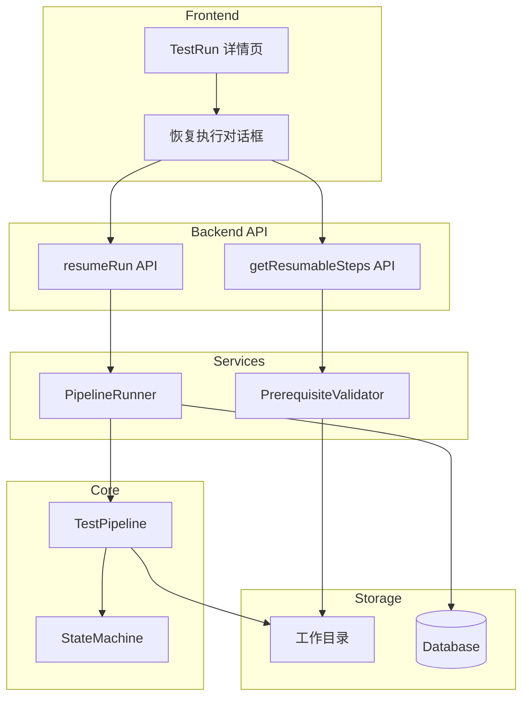
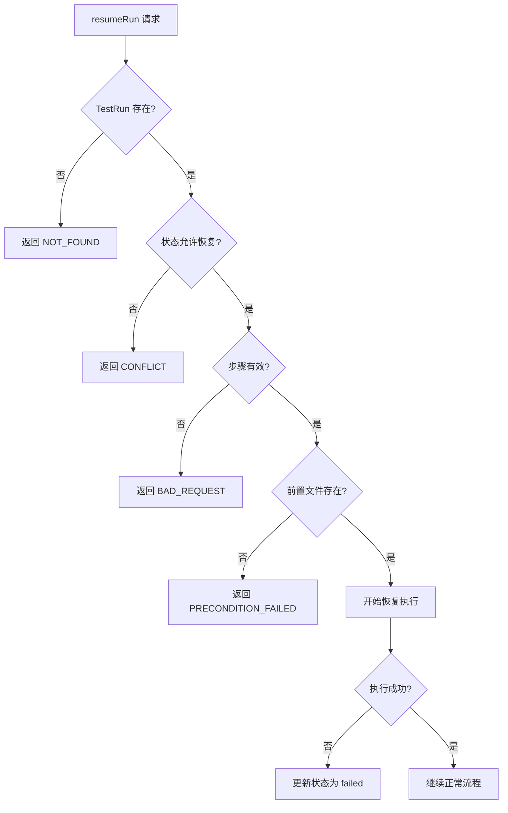

# 设计文档：Pipeline 恢复执行功能

## 概述

本设计实现 Pipeline 流程的"断点续跑"能力。核心思路是：
1. 定义每个步骤所需的前置文件映射
2. 验证工作目录中是否存在所需文件
3. 修改 Pipeline 执行逻辑，支持从指定步骤开始执行
4. 提供 API 和前端界面供用户操作

## 架构



## 组件和接口

### 1. PrerequisiteValidator（前置文件验证器）

新增组件，负责验证恢复执行所需的前置文件。

```typescript
// packages/core/src/pipeline/prerequisite-validator.ts

/**
 * Pipeline 步骤枚举
 */
export type PipelineStep = 
  | 'initialize'
  | 'prd_parsing'
  | 'test_execution'
  | 'codex_review'
  | 'cross_validation'
  | 'report_generation'
  | 'quality_gate';

/**
 * 可恢复的步骤（排除 initialize，因为它是初始化步骤）
 */
export type ResumableStep = Exclude<PipelineStep, 'initialize'>;

/**
 * 步骤前置文件映射
 */
export const STEP_PREREQUISITES: Record<ResumableStep, string[]> = {
  prd_parsing: ['inputs/prd.md'],
  test_execution: ['outputs/requirements.json', 'outputs/test-cases.json'],
  codex_review: ['outputs/execution-results.json'],
  cross_validation: ['outputs/codex-review-results.json'],
  report_generation: ['outputs/cross-validation-results.json'],
  quality_gate: ['outputs/report.html'],
};

/**
 * 步骤执行顺序
 */
export const STEP_ORDER: PipelineStep[] = [
  'initialize',
  'prd_parsing',
  'test_execution',
  'codex_review',
  'cross_validation',
  'report_generation',
  'quality_gate',
];

/**
 * 验证结果
 */
export interface ValidationResult {
  valid: boolean;
  missingFiles: string[];
}

/**
 * 可恢复步骤信息
 */
export interface ResumableStepInfo {
  step: ResumableStep;
  label: string;
  available: boolean;
  missingFiles: string[];
}

export class PrerequisiteValidator {
  constructor(private workspaceRoot: string) {}

  /**
   * 验证指定步骤的前置文件是否存在
   */
  async validateStep(runId: string, step: ResumableStep): Promise<ValidationResult>;

  /**
   * 获取所有可恢复的步骤
   */
  async getResumableSteps(runId: string): Promise<ResumableStepInfo[]>;

  /**
   * 检查文件是否存在（支持目录检查）
   */
  private async fileExists(filePath: string): Promise<boolean>;
}
```

### 2. PipelineConfig 扩展

扩展现有的 PipelineConfig 接口，支持从指定步骤开始执行。

```typescript
// packages/core/src/pipeline/index.ts

export interface PipelineConfig {
  projectId: string;
  prdPath: string;
  routes: string[];
  targetProfile: TargetProfile;
  workspaceRoot: string;
  promptsDir: string;
  existingRunId?: string;
  skipStateTransitions?: boolean;
  
  // 新增字段
  startFromStep?: ResumableStep;  // 从指定步骤开始执行
  isResume?: boolean;             // 标记是否为恢复执行
}
```

### 3. TestPipeline 扩展

修改 TestPipeline 类，支持跳过已完成的步骤。

```typescript
// packages/core/src/pipeline/index.ts

export class TestPipeline {
  // ... 现有代码 ...

  /**
   * 执行 Pipeline（支持从指定步骤恢复）
   */
  async execute(config: PipelineConfig): Promise<PipelineResult> {
    // 如果指定了 startFromStep，跳过之前的步骤
    const startIndex = config.startFromStep 
      ? STEP_ORDER.indexOf(config.startFromStep)
      : 0;
    
    // 为跳过的步骤创建 skipped 状态的 StepResult
    // 然后从 startIndex 开始执行
  }

  /**
   * 创建跳过步骤的结果
   */
  private createSkippedStepResult(step: string): StepResult {
    return {
      step,
      status: 'skipped',
      duration: 0,
    };
  }
}
```

### 4. PipelineRunner 扩展

扩展 PipelineRunner，新增 resumePipeline 方法。

```typescript
// apps/server/src/services/pipeline-runner.ts

export class PipelineRunner {
  // ... 现有代码 ...

  /**
   * 恢复执行 Pipeline
   */
  async resumePipeline(runId: string, fromStep: ResumableStep): Promise<void> {
    // 1. 验证 TestRun 存在且状态允许恢复
    // 2. 验证前置文件存在
    // 3. 创建 PipelineConfig，设置 startFromStep
    // 4. 执行 Pipeline
  }
}
```

### 5. tRPC API

新增 tRPC 路由处理恢复执行请求。

```typescript
// apps/server/src/trpc/routers/testRun.ts

// 新增输入 schema
const resumeRunInputSchema = z.object({
  runId: z.string().uuid(),
  fromStep: z.enum([
    'prd_parsing',
    'test_execution',
    'codex_review',
    'cross_validation',
    'report_generation',
    'quality_gate',
  ]),
});

// 新增路由
export const testRunRouter = router({
  // ... 现有路由 ...

  /**
   * 获取可恢复的步骤列表
   */
  getResumableSteps: publicProcedure
    .input(z.object({ runId: z.string().uuid() }))
    .query(async ({ input }) => {
      // 返回可恢复步骤列表
    }),

  /**
   * 恢复执行 Pipeline
   */
  resumeRun: publicProcedure
    .input(resumeRunInputSchema)
    .mutation(async ({ input }) => {
      // 调用 PipelineRunner.resumePipeline
    }),
});
```

### 6. WebSocket 事件

新增 WebSocket 事件类型。

```typescript
// packages/shared/src/types/index.ts

export type PipelineEventType =
  | 'step_started'
  | 'step_completed'
  | 'step_failed'
  | 'step_skipped'      // 新增：步骤被跳过
  | 'pipeline_resumed'  // 新增：Pipeline 恢复执行
  | 'state_changed'
  | 'screenshot_captured'
  | 'approval_required'
  | 'confirmation_required'
  | 'cli_log';
```

## 数据模型

### 步骤前置文件映射

| 步骤 | 前置文件 | 说明 |
|------|----------|------|
| prd_parsing | inputs/prd.md | PRD 文档 |
| test_execution | outputs/requirements.json, outputs/test-cases.json | 需求和测试用例 |
| codex_review | outputs/execution-results.json | 测试执行结果 |
| cross_validation | outputs/codex-review-results.json | Codex 审核结果 |
| report_generation | outputs/cross-validation-results.json | 交叉验证结果 |
| quality_gate | outputs/report.html | 测试报告 |

### 步骤中文名称映射

| 步骤 | 中文名称 |
|------|----------|
| prd_parsing | PRD 解析 |
| test_execution | 测试执行 |
| codex_review | Codex 审核 |
| cross_validation | 交叉验证 |
| report_generation | 报告生成 |
| quality_gate | 质量门检查 |

### 状态转换映射

恢复执行时，需要将 TestRun 状态更新为对应步骤的状态：

| 恢复步骤 | 目标状态 |
|----------|----------|
| prd_parsing | parsing |
| test_execution | executing |
| codex_review | codex_reviewing |
| cross_validation | codex_reviewing |
| report_generation | report_ready |
| quality_gate | report_ready |


## 正确性属性

*正确性属性是一种应该在系统所有有效执行中保持为真的特征或行为——本质上是关于系统应该做什么的形式化陈述。属性作为人类可读规范和机器可验证正确性保证之间的桥梁。*

### Property 1: 前置文件验证一致性

*对于任意* 步骤和任意文件存在状态组合，验证器返回的 `valid` 字段应该为 `true` 当且仅当该步骤定义的所有前置文件都存在。

**Validates: Requirements 2.1, 2.2, 2.3, 2.4, 2.5, 2.6**

### Property 2: 缺失文件报告完整性

*对于任意* 步骤和任意文件存在状态组合，验证器返回的 `missingFiles` 数组应该精确包含所有不存在的前置文件路径。

**Validates: Requirements 1.2, 2.7**

### Property 3: 可恢复步骤与文件存在一致性

*对于任意* 工作目录文件组合，`getResumableSteps` 返回的步骤列表中，某个步骤被标记为 `available: true` 当且仅当该步骤的所有前置文件都存在。

**Validates: Requirements 3.1, 3.2, 3.3, 3.4, 3.5**

### Property 4: 可恢复步骤排序正确性

*对于任意* `getResumableSteps` 的返回结果，步骤列表应该按照 `STEP_ORDER` 定义的顺序排列。

**Validates: Requirements 3.6**

### Property 5: 跳过步骤标记正确性

*对于任意* 恢复执行配置（指定 `startFromStep`），Pipeline 执行结果中，所有在 `startFromStep` 之前的步骤都应该被标记为 `skipped` 状态。

**Validates: Requirements 4.1, 4.2, 4.5**

### Property 6: 运行中状态阻止恢复

*对于任意* 处于 `executing` 或 `codex_reviewing` 状态的 TestRun，调用 `resumeRun` 应该返回错误。

**Validates: Requirements 1.5**

### Property 7: 恢复执行状态转换正确性

*对于任意* 恢复执行操作，TestRun 的状态应该被更新为 `fromStep` 对应的状态（根据 STEP_TO_STATE 映射）。

**Validates: Requirements 6.1, 6.4**

### Property 8: WebSocket 跳过事件完整性

*对于任意* 恢复执行操作，每个被跳过的步骤都应该触发一个 `step_skipped` 事件，且事件包含 `runId`、`step`、`timestamp` 字段。

**Validates: Requirements 7.2, 7.4**

## 错误处理

### 错误类型

| 错误场景 | 错误码 | 错误消息 | HTTP 状态码 |
|----------|--------|----------|-------------|
| TestRun 不存在 | NOT_FOUND | TestRun not found | 404 |
| 无效的步骤名称 | BAD_REQUEST | Invalid step name | 400 |
| TestRun 正在执行 | CONFLICT | TestRun is already running | 409 |
| 前置文件缺失 | PRECONDITION_FAILED | Missing prerequisite files: [files] | 412 |
| 工作目录不存在 | NOT_FOUND | Workspace not found | 404 |

### 错误处理流程



## 测试策略

### 单元测试

1. **PrerequisiteValidator 测试**
   - 测试各种文件存在/不存在组合
   - 测试目录检查（test-cases/ 目录）
   - 测试边界条件（空目录、权限问题）

2. **PipelineRunner.resumePipeline 测试**
   - 测试状态验证逻辑
   - 测试前置文件验证调用
   - 测试 Pipeline 配置构建

3. **tRPC API 测试**
   - 测试输入验证
   - 测试错误响应格式
   - 测试成功响应格式

### 属性测试

使用 fast-check 库进行属性测试，每个属性测试至少运行 100 次迭代。

1. **Property 1 & 2: 前置文件验证**
   - 生成随机的文件存在状态
   - 验证验证结果与预期一致

2. **Property 3 & 4: 可恢复步骤查询**
   - 生成随机的工作目录文件组合
   - 验证返回的步骤列表正确

3. **Property 5: 跳过步骤标记**
   - 生成随机的 startFromStep
   - 验证跳过步骤的标记正确

4. **Property 6: 运行中状态阻止**
   - 生成随机的运行中状态
   - 验证恢复执行被拒绝

5. **Property 7: 状态转换**
   - 生成随机的恢复步骤
   - 验证状态更新正确

6. **Property 8: WebSocket 事件**
   - 生成随机的恢复配置
   - 验证事件发送正确

### 集成测试

1. **端到端恢复执行测试**
   - 创建完整的测试工作目录
   - 执行恢复操作
   - 验证 Pipeline 正确执行

2. **前端组件测试**
   - 测试恢复执行对话框渲染
   - 测试步骤选择交互
   - 测试 API 调用集成
