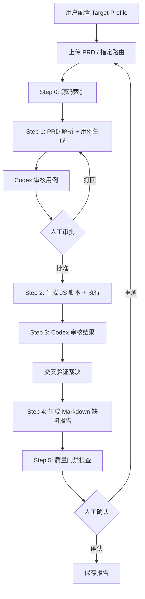
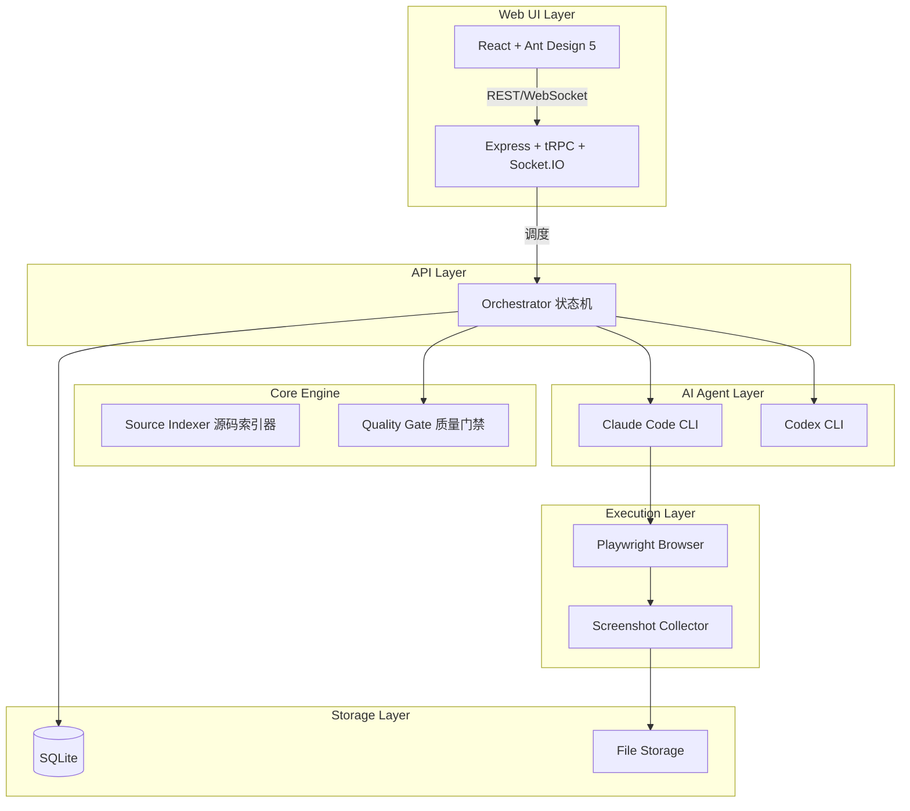
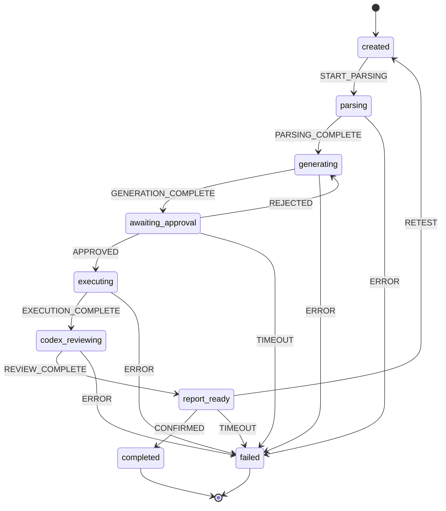

# Design Document: PRD-Based UI Testing Agent System

## Overview

PRD-Based UI Testing Agent System 是一个基于 AI 的自动化测试系统，实现从 PRD 文档到 Markdown 测试报告的完整闭环。系统采用 Monorepo 架构，使用 Turborepo + pnpm 管理多个包，核心技术栈包括 TypeScript、Express + tRPC、React 18 + Ant Design 5、SQLite + Prisma、Socket.IO 和 Playwright。

### 核心流程



### 设计原则

1. **源码辅助生成**: 通过解析前端源码（路由表、页面组件、API 定义）提升 Playwright 选择器准确率
2. **JS 脚本直接执行**: 生成完整的 Playwright JS 测试脚本后通过 `node` 直接执行，而非 MCP 逐步调用
3. **交叉审核机制**: Claude Code 执行 + Codex 审核，双重验证确保结果可靠
4. **状态机驱动**: 8 态状态机管理测试流程，支持幂等性和异常恢复
5. **质量门禁**: RC/APR/FR 三重指标确保测试质量
6. **Markdown 报告**: 输出易于阅读和分享的 Markdown 格式报告

### 系统架构图



### Monorepo 结构

```
smart-test-agent/
├── apps/
│   ├── web/                    # React + Ant Design 前端
│   └── server/                 # Express + tRPC 后端
├── packages/
│   ├── core/                   # 核心业务逻辑
│   │   ├── orchestrator/       # 状态机编排引擎
│   │   ├── source-indexer/     # 源码索引器
│   │   ├── cli-adapter/        # Claude Code / Codex CLI 适配器
│   │   ├── quality-gate/       # 质量门禁计算
│   │   └── report-generator/   # Markdown 报告生成器
│   ├── playwright-runner/      # Playwright 执行器
│   ├── shared/                 # 共享类型和工具
│   │   ├── types/              # TypeScript 类型定义
│   │   ├── schemas/            # JSON Schema 定义
│   │   └── utils/              # 通用工具函数
│   └── db/                     # Prisma 数据库层
├── prompts/                    # AI Prompt 模板
│   ├── prd-parse.md
│   ├── ui-test-execute.md
│   └── review-results.md
├── turbo.json
├── pnpm-workspace.yaml
└── package.json
```

## Components and Interfaces

### 1. Target Profile Manager

负责管理测试目标项目的配置信息。

```typescript
interface TargetProfile {
  id: string;
  projectId: string;
  baseUrl: string;
  browser: BrowserConfig;
  login: LoginConfig;
  allowedRoutes: string[];
  deniedRoutes?: string[];
  allowedOperations: OperationType[];
  deniedOperations?: OperationType[];
  sourceCode: SourceCodeConfig;
  uiFramework: 'antd' | 'element-ui' | 'custom';
  antdQuirks?: AntdQuirksConfig;
}

interface BrowserConfig {
  ignoreHTTPSErrors: boolean;
  viewport: { width: number; height: number };
  locale: string;
  timeoutMs: number;
}

interface LoginConfig {
  loginUrl: string;
  usernameSelector: string;
  passwordSelector: string;
  submitSelector: string;
  credentials: {
    username: string;  // 环境变量引用，如 $TEST_USERNAME
    password: string;  // 环境变量引用，如 $TEST_PASSWORD
  };
  successIndicator: string;
  tenantValue?: string;
  tenantAlreadySelected?: boolean;
}

interface SourceCodeConfig {
  frontendRoot: string;
  routerFile: string;
  pageDir: string;
  apiDir: string;
}

interface AntdQuirksConfig {
  buttonTextSpace: boolean;      // 两字中文按钮自动插入空格
  selectType: 'custom' | 'native';
  modalCloseSelector: string;    // 默认 '.ant-modal-close'
}

type OperationType = 'query' | 'view_detail' | 'search' | 'filter' | 'paginate' | 'create' | 'edit' | 'delete';
```

### 2. Source Indexer

负责解析前端源码，提取测试上下文。

```typescript
interface SourceIndexer {
  parseRouterFile(routerPath: string): Promise<RouteMapping[]>;
  extractPageComponent(componentPath: string): Promise<ExtractedComponent>;
  extractApiDefinition(apiPath: string): Promise<ExtractedApi>;
  detectFrameworkType(routerPath: string): Promise<'vue' | 'react'>;
  generateSourceContext(route: string, profile: TargetProfile): Promise<SourceContext>;
}

interface RouteMapping {
  path: string;
  componentPath: string;
  menuKey?: string;
  children?: RouteMapping[];
}

interface ExtractedComponent {
  filePath: string;
  framework: 'vue' | 'react';
  template?: string;
  scriptExports?: string;
  apiImports: string[];
  truncated: boolean;
}
```

**Vue/React 双框架提取策略**:

| 框架 | 文件类型 | 正常提取 | >500行裁剪策略 |
|------|---------|---------|---------------|
| Vue | .vue | 完整文件 | `<template>` 完整 + `<script>` 中 export default 对象 |
| React | .tsx/.jsx | 完整文件 | 组件函数签名 + useState/useEffect hooks + JSX return 语句 |

### 3. Orchestrator (状态机编排引擎)

负责管理测试运行的状态流转。

```typescript
interface Orchestrator {
  createRun(projectId: string, prdPath: string, routes: string[]): Promise<TestRun>;
  transition(runId: string, event: StateEvent): Promise<TestRun>;
  getState(runId: string): Promise<TestRunState>;
  handleApproval(runId: string, decision: ApprovalDecision): Promise<TestRun>;
  handleConfirmation(runId: string, decision: ConfirmationDecision): Promise<TestRun>;
}

type TestRunState = 
  | 'created'
  | 'parsing'
  | 'generating'
  | 'awaiting_approval'
  | 'executing'
  | 'codex_reviewing'
  | 'report_ready'
  | 'completed'
  | 'failed';

type ReasonCode = 
  | 'retry_exhausted'
  | 'agent_timeout'
  | 'approval_timeout'
  | 'confirm_timeout'
  | 'verdict_conflict'
  | 'playwright_error'
  | 'internal_error';
```

**状态机流转图**:



### 4. CLI Adapter

负责封装 Claude Code 和 Codex CLI 调用。

```typescript
interface CliAdapter {
  probeCapabilities(): Promise<CliCapabilities>;
  invokeClaudeCode(params: ClaudeCodeParams): Promise<ClaudeCodeResult>;
  invokeCodex(params: CodexParams): Promise<CodexResult>;
}

interface CliCapabilities {
  claudeCode: {
    supportsStreamJson: boolean;
    supportsAllowedTools: boolean;
    version: string;
  };
  codex: {
    supportsSuggestMode: boolean;
    supportsOutputSchema: boolean;
    version: string;
  };
}
```

**降级策略**:

| 能力 | 正常模式 | 降级模式 |
|------|---------|---------|
| stream-json | `--output-format stream-json` | `--output-format json` + 轮询 |
| allowed-tools | `--allowedTools Bash,Read,Write` | Prompt 约束 |
| suggest-mode | `--approval-mode suggest` | 只读 Prompt + 人工解读 |

### 5. Playwright Runner

负责执行 Playwright 测试脚本。

```typescript
interface PlaywrightRunner {
  generateScript(testCases: TestCase[], profile: TargetProfile): Promise<string>;
  executeScript(scriptPath: string, runId: string): Promise<ExecutionResult>;
  collectScreenshots(runId: string): Promise<Screenshot[]>;
}

interface TestCase {
  caseId: string;
  requirementId: string;
  route: string;
  title: string;
  precondition: string;
  steps: TestStep[];
  assertions: Assertion[];
  dataPreparation?: DataStep[];
  dataCleanup?: DataStep[];
}

interface DataStep {
  action: 'create' | 'update' | 'delete' | 'api_call';
  target: string;
  data?: Record<string, any>;
  cleanup?: boolean;
}
```

**Ant Design 选择器专项规则**:

| 场景 | 规则 | 示例 |
|------|------|------|
| 两字中文按钮 | 使用正则匹配 | `getByRole('button', { name: /关.*闭/ })` |
| 三字及以上按钮 | 精确文本匹配 | `getByRole('button', { name: '保存配置' })` |
| Ant Design Select | 点击 selector + 选择 option | `.ant-select-selector` → `.ant-select-item-option` |
| Modal 关闭 | 优先 X 按钮 | `.ant-modal-close` |
| 视口外元素 | 先滚动再断言 | `scrollIntoViewIfNeeded()` |
| Switch 状态 | 使用 class 判断 | `.ant-switch-checked` |

### 6. Quality Gate Calculator

负责计算质量门禁指标。

```typescript
interface QualityGateCalculator {
  calculateRC(requirements: Requirement[], testCases: TestCase[]): QualityMetric;
  calculateAPR(executionResults: ExecutionResult): QualityMetric;
  calculateFR(runHistory: TestRun[]): QualityMetric | null;
  evaluate(metrics: QualityMetrics): GateResult;
}

interface QualityMetric {
  name: 'RC' | 'APR' | 'FR';
  value: number;
  threshold: number;
  passed: boolean;
}

interface GateResult {
  passed: boolean;
  blocked: boolean;
  warnings: string[];
  metrics: QualityMetric[];
}
```

### 7. Markdown Report Generator

负责生成 Markdown 格式的测试报告。

```typescript
interface MarkdownReportGenerator {
  generateReport(data: ReportData): Promise<string>;
  saveReport(runId: string, content: string): Promise<string>;
}

interface ReportData {
  runId: string;
  summary: {
    totalDefects: number;
    severityDistribution: Record<string, number>;
    affectedRoutes: string[];
    qualityMetrics: QualityMetric[];
  };
  defects: DefectReport[];
  testCases: TestCaseSummary[];
}

interface DefectReport {
  id: string;
  severity: 'critical' | 'major' | 'minor' | 'suggestion';
  title: string;
  description: string;
  screenshots: string[];
  operationSteps: string[];
}
```

**Markdown 报告模板**:

```markdown
# 测试报告 - {run_id}

## 摘要

- **执行时间**: {timestamp}
- **测试路由**: {routes}
- **总缺陷数**: {total_defects}
- **严重程度分布**: Critical: {n}, Major: {n}, Minor: {n}

## 质量指标

| 指标 | 值 | 阈值 | 状态 |
|------|-----|------|------|
| 需求覆盖率 (RC) | {value} | ≥0.85 | {status} |
| 断言通过率 (APR) | {value} | ≥0.95 | {status} |

## 缺陷列表

### 缺陷 1: {title}

**严重程度**: {severity}

**描述**: {description}

**操作步骤**:
1. {step1}
2. {step2}

**截图**:


---

## 测试用例汇总

| 用例ID | 标题 | 状态 | 断言数 |
|--------|------|------|--------|
| {case_id} | {title} | {status} | {assertions} |
```

### 8. WebSocket Event Manager

负责实时推送测试状态更新。

```typescript
interface WebSocketEventManager {
  emitStateTransition(runId: string, state: TestRunState): void;
  emitStepCompleted(runId: string, step: CompletedStep): void;
  emitStepScreenshot(runId: string, screenshot: ScreenshotInfo): void;
}
```

## Data Models

### 数据库 Schema (Prisma)

```prisma
model Project {
  id            String         @id @default(uuid())
  name          String
  description   String?
  targetProfile TargetProfile?
  testRuns      TestRun[]
  createdAt     DateTime       @default(now())
  updatedAt     DateTime       @updatedAt
}

model TargetProfile {
  id                String   @id @default(uuid())
  projectId         String   @unique
  project           Project  @relation(fields: [projectId], references: [id])
  baseUrl           String
  browserConfig     Json
  loginConfig       Json
  allowedRoutes     String[]
  deniedRoutes      String[]
  allowedOperations String[]
  deniedOperations  String[]
  sourceCodeConfig  Json
  uiFramework       String
  antdQuirks        Json?
  createdAt         DateTime @default(now())
  updatedAt         DateTime @updatedAt
}

model TestRun {
  id              String        @id @default(uuid())
  projectId       String
  project         Project       @relation(fields: [projectId], references: [id])
  state           String
  reasonCode      String?
  prdPath         String
  testedRoutes    String[]
  workspacePath   String
  envFingerprint  Json
  agentVersions   Json
  promptVersions  Json
  decisionLog     Json[]
  qualityMetrics  Json?
  reportPath      String?       // Markdown 报告路径
  createdAt       DateTime      @default(now())
  updatedAt       DateTime      @updatedAt
  completedAt     DateTime?
  
  requirements    Requirement[]
  testCases       TestCase[]
  assertions      Assertion[]
}

model Requirement {
  id                 String     @id @default(uuid())
  runId              String
  run                TestRun    @relation(fields: [runId], references: [id])
  requirementId      String
  title              String
  description        String
  priority           String
  testable           Boolean
  route              String
  acceptanceCriteria String[]
  sourceSection      String?
  tags               String[]
  testCases          TestCase[]
}

model TestCase {
  id            String      @id @default(uuid())
  runId         String
  run           TestRun     @relation(fields: [runId], references: [id])
  requirementId String
  requirement   Requirement @relation(fields: [requirementId], references: [id])
  caseId        String
  route         String
  title         String
  precondition  String
  steps         Json
  dataPreparation Json?
  dataCleanup   Json?
  status        String?
  assertions    Assertion[]
}

model Assertion {
  id             String    @id @default(uuid())
  runId          String
  run            TestRun   @relation(fields: [runId], references: [id])
  caseId         String
  testCase       TestCase  @relation(fields: [caseId], references: [id])
  assertionId    String
  type           String
  description    String
  expected       String
  actual         String?
  machineVerdict String?
  agentVerdict   String?
  agentReasoning String?
  reviewVerdict  String?
  conflictType   String?
  finalVerdict   String?
  evidencePath   String?
}
```

## Correctness Properties

*A property is a characteristic or behavior that should hold true across all valid executions of a system—essentially, a formal statement about what the system should do. Properties serve as the bridge between human-readable specifications and machine-verifiable correctness guarantees.*

### Property 1: Target Profile Configuration Round-Trip

*For any* valid TargetProfile object, saving it to the database and then retrieving it should produce an equivalent object with all fields preserved.

**Validates: Requirements 1.1, 1.2, 1.3**

### Property 2: Environment Variable Resolution

*For any* credential string starting with `$` prefix, the system should resolve it from environment variables.

**Validates: Requirements 1.3**

### Property 3: Browser Context Configuration Propagation

*For any* TargetProfile with browser.ignoreHTTPSErrors set to true, the created Playwright browser context should have ignoreHTTPSErrors option enabled.

**Validates: Requirements 1.5**

### Property 4: Ant Design Button Selector Pattern

*For any* button text that is exactly two Chinese characters and antd_quirks.button_text_space is true, the generated selector should use a regex pattern with wildcard.

**Validates: Requirements 1.7, 4.3, 4.4**

### Property 5: Route to Component Mapping

*For any* valid route path in the router file, the Source_Indexer should return the correct component file path.

**Validates: Requirements 2.1**

### Property 6: Source File Extraction Preserves Key Content

*For any* source file (Vue or React), if the file exceeds 500 lines, the extracted content should contain the key sections as defined.

**Validates: Requirements 2.4, 2.5, 2.6, 2.7, 2.8**

### Property 7: Framework Detection Accuracy

*For any* router file, the detected framework type should match the actual framework used.

**Validates: Requirements 2.9**

### Property 8: JSON Output Schema Compliance

*For any* JSON output from the system, the output should validate against its corresponding JSON Schema.

**Validates: Requirements 3.2, 4.7, 4.8, 5.2, 7.5**

### Property 9: Selector Priority Ordering

*For any* generated Playwright selector, the system should prefer them in the defined priority order.

**Validates: Requirements 4.2**

### Property 14: State Machine Transition Correctness

*For any* valid state and event combination, the state machine should transition to the correct next state.

**Validates: Requirements 6.1, 6.3, 6.4, 6.5, 13.1, 13.3, 13.4, 13.5, 14.1, 14.2**

### Property 15: State Machine Idempotency

*For any* state transition attempt with the same (run_id, state, shard_id) tuple, subsequent attempts should be no-ops.

**Validates: Requirements 14.4, 14.5**

### Property 17: Test Script Structure Completeness

*For any* generated Playwright test script, the script should contain all required sections.

**Validates: Requirements 7.1, 7.2**

### Property 23: Cross-Validation Arbitration Rules

*For any* assertion result with machine_verdict/agent_verdict and Codex review_verdict, the arbitration should follow the defined rules.

**Validates: Requirements 9.1, 9.2, 9.3, 9.4, 9.5**

### Property 24: Defect Report Aggregation

*For any* set of assertion results, the defect report should contain exactly all assertions with final_verdict = 'fail'.

**Validates: Requirements 11.1**

### Property 26: Requirements Coverage Calculation

*For any* set of requirements and test cases, RC should equal (covered requirements) / (total testable requirements).

**Validates: Requirements 12.1**

### Property 27: Assertion Pass Rate Calculation

*For any* execution result, APR should equal (passed deterministic assertions) / (total executed deterministic assertions).

**Validates: Requirements 12.2**

### Property 30: Workspace Directory Structure

*For any* test run, the workspace should be created with the required directory structure.

**Validates: Requirements 15.1**

### Property 31: Manifest Completeness

*For any* test run manifest.json, it should contain all required fields.

**Validates: Requirements 15.2, 15.3**

### Property 33: CLI Capability Detection

*For any* CLI, the capability probe should correctly detect supported features.

**Validates: Requirements 16.1, 16.2**

### Property 36: WebSocket Event Structure

*For any* state change, a WebSocket event should be emitted with the correct structure.

**Validates: Requirements 17.2, 17.3, 17.4, 17.5, 17.6, 17.7**

### Property 37: Test Data Cleanup Guarantee

*For any* test run that creates test data, the cleanup process should be executed regardless of test success or failure.

**Validates: Requirements 19.4, 19.5**

## Error Handling

### Error Categories and Handling Strategies

| Error Category | Reason Code | Handling Strategy | Recovery |
|---------------|-------------|-------------------|----------|
| Network/Rate Limit | retry_exhausted | Exponential backoff, max 3 retries | Manual retry |
| AI Agent Timeout | agent_timeout | 5-minute timeout per AI call | Check CLI status, retry |
| Approval Timeout | approval_timeout | 24-hour timeout | Re-initiate test run |
| Confirmation Timeout | confirm_timeout | 48-hour timeout | Mark as unconfirmed |
| Verdict Conflict | verdict_conflict | Log conflict details | Manual arbitration |
| Playwright Error | playwright_error | Capture error details | Check selectors, retry |
| Internal Error | internal_error | Log stack trace | Fix and retry |

## Testing Strategy

### Dual Testing Approach

- **单元测试**: 验证具体示例、边界情况和错误条件
- **属性测试**: 验证跨所有输入的通用属性

### Property-Based Testing Configuration

- **测试框架**: fast-check (TypeScript)
- **最小迭代次数**: 100 次/属性
- **标签格式**: `Feature: prd-ui-testing-agent, Property {number}: {property_text}`

### Test Categories

| Category | Test Type | Coverage Target |
|----------|-----------|-----------------|
| Configuration Management | Property + Unit | Properties 1-4 |
| Source Indexing | Property + Unit | Properties 5-7 |
| JSON Schema Validation | Property | Property 8 |
| Selector Generation | Property + Unit | Property 9 |
| State Machine | Property + Unit | Properties 14-15 |
| Script Generation | Property + Unit | Property 17 |
| Cross-Validation | Property | Property 23 |
| Defect Reporting | Property + Unit | Property 24 |
| Quality Gates | Property | Properties 26-27 |
| Workspace Management | Property + Unit | Properties 30-31 |
| CLI Integration | Property + Unit | Property 33 |
| WebSocket Events | Property + Unit | Property 36 |
| Test Data Management | Property + Unit | Property 37 |
