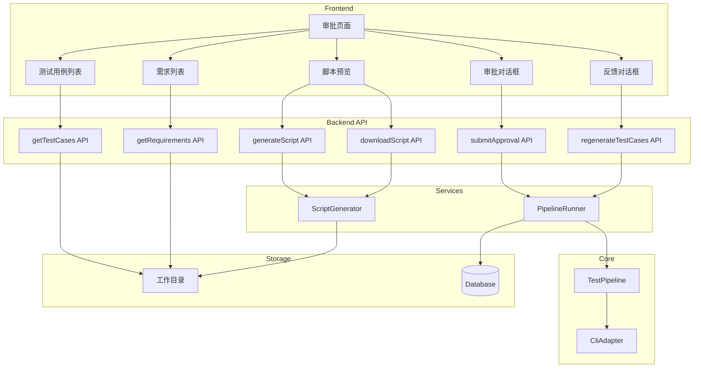
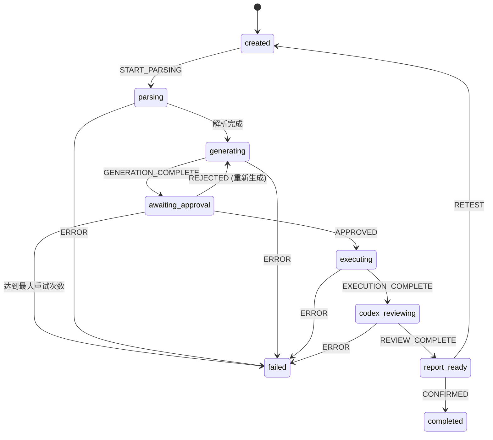

# 设计文档：测试用例审批流程优化

## 概述

本设计优化测试用例生成后的审批流程，主要包括：
1. 修复状态流转问题，确保正确进入等待审批状态
2. 实现测试用例和需求的展示界面
3. 实现审批操作和反馈机制
4. 实现基于反馈的重新生成功能
5. 实现 Playwright 脚本预览和下载功能

## 架构



## 组件和接口

### 1. 状态流转修复

当前问题分析：
- `prd_parsing` 步骤完成后，Pipeline 继续执行而没有等待审批
- 需要在 `approval_required` 事件触发后暂停执行

修复方案：

```typescript
// packages/core/src/pipeline/index.ts

export class TestPipeline {
  async execute(config: PipelineConfig): Promise<PipelineResult> {
    // ... PRD 解析步骤 ...
    
    await this.transitionState(runId, 'GENERATION_COMPLETE');
    this.emit('approval_required', runId, { 
      testCasesPath: parseResult.artifacts?.testCasesPath,
      requirementsPath: parseResult.artifacts?.requirementsPath,
    });
    
    // 关键修复：如果不是恢复执行，需要等待审批
    if (!config.isResume && !config.skipApproval) {
      // 返回中间结果，等待审批后继续
      return {
        runId,
        status: 'awaiting_approval',
        steps,
        awaitingApproval: true,
      };
    }
    
    // ... 后续步骤 ...
  }
}
```

### 2. 测试用例和需求查询 API

```typescript
// apps/server/src/trpc/routers/testRun.ts

/**
 * 测试用例查询结果
 */
interface TestCaseQueryResult {
  testCases: TestCase[];
  total: number;
  byRequirement: Record<string, TestCase[]>;
}

/**
 * 需求查询结果
 */
interface RequirementQueryResult {
  requirements: Requirement[];
  total: number;
  byPriority: {
    P0: Requirement[];
    P1: Requirement[];
    P2: Requirement[];
  };
}

export const testRunRouter = router({
  // ... 现有路由 ...

  /**
   * 获取测试用例列表
   */
  getTestCases: publicProcedure
    .input(z.object({ 
      runId: z.string().uuid(),
      requirementId: z.string().optional(),
    }))
    .query(async ({ input }): Promise<TestCaseQueryResult> => {
      // 从工作目录读取 test-cases.json 或 test-cases/ 目录
    }),

  /**
   * 获取需求列表
   */
  getRequirements: publicProcedure
    .input(z.object({ runId: z.string().uuid() }))
    .query(async ({ input }): Promise<RequirementQueryResult> => {
      // 从工作目录读取 requirements.json
    }),
});
```

### 3. 重新生成 API

```typescript
// apps/server/src/trpc/routers/testRun.ts

/**
 * 重新生成反馈类型
 */
const feedbackTypeSchema = z.enum([
  'coverage_incomplete',    // 测试用例覆盖不全
  'steps_incorrect',        // 测试步骤不正确
  'assertions_inaccurate',  // 断言不准确
  'other',                  // 其他
]);

/**
 * 重新生成输入
 */
const regenerateInputSchema = z.object({
  runId: z.string().uuid(),
  feedbackType: feedbackTypeSchema,
  feedbackDetail: z.string().min(1, '请提供具体的反馈意见'),
  reviewerId: z.string(),
});

export const testRunRouter = router({
  // ... 现有路由 ...

  /**
   * 基于反馈重新生成测试用例
   */
  regenerateTestCases: publicProcedure
    .input(regenerateInputSchema)
    .mutation(async ({ input, ctx }) => {
      // 1. 验证 TestRun 状态为 awaiting_approval
      // 2. 检查重新生成次数是否超过限制（3次）
      // 3. 构建包含反馈的 prompt
      // 4. 调用 Claude Code 重新生成
      // 5. 更新状态，再次进入 awaiting_approval
    }),
});
```

### 4. ScriptGenerator 组件

新增组件，负责生成 Playwright 脚本。

```typescript
// packages/core/src/script-generator/index.ts

export interface ScriptGeneratorConfig {
  targetProfile: TargetProfile;
  promptTemplate: string;
}

export interface GeneratedScript {
  caseId: string;
  script: string;
  filename: string;
}

export class ScriptGenerator {
  constructor(private config: ScriptGeneratorConfig) {}

  /**
   * 为单个测试用例生成脚本
   */
  generateForTestCase(testCase: TestCase): GeneratedScript {
    // 使用 ui-test-execute.md 模板生成脚本
  }

  /**
   * 为多个测试用例生成脚本
   */
  generateForTestCases(testCases: TestCase[]): GeneratedScript[] {
    return testCases.map(tc => this.generateForTestCase(tc));
  }

  /**
   * 生成完整的可执行脚本文件
   */
  generateExecutableScript(testCases: TestCase[]): string {
    // 生成包含所有测试用例的完整脚本
  }

  /**
   * 打包脚本为 zip 文件
   */
  async packageScripts(scripts: GeneratedScript[]): Promise<Buffer> {
    // 使用 archiver 打包
  }
}
```

### 5. 脚本生成和下载 API

```typescript
// apps/server/src/trpc/routers/testRun.ts

export const testRunRouter = router({
  // ... 现有路由 ...

  /**
   * 生成 Playwright 脚本预览
   */
  generateScript: publicProcedure
    .input(z.object({
      runId: z.string().uuid(),
      caseIds: z.array(z.string()).optional(), // 不传则生成所有
    }))
    .query(async ({ input }) => {
      // 返回生成的脚本内容
    }),

  /**
   * 下载 Playwright 脚本
   */
  downloadScript: publicProcedure
    .input(z.object({
      runId: z.string().uuid(),
      caseIds: z.array(z.string()).optional(),
      format: z.enum(['single', 'zip']).default('single'),
    }))
    .mutation(async ({ input }) => {
      // 返回下载 URL 或 base64 内容
    }),
});
```

### 6. 前端组件

#### 6.1 TestCaseApprovalPage 组件

```typescript
// apps/web/src/pages/TestCaseApproval.tsx

interface TestCaseApprovalPageProps {
  runId: string;
}

export const TestCaseApprovalPage: React.FC<TestCaseApprovalPageProps> = ({ runId }) => {
  // 状态
  const [activeTab, setActiveTab] = useState<'requirements' | 'testcases'>('requirements');
  const [selectedRequirement, setSelectedRequirement] = useState<string | null>(null);
  const [scriptPreviewOpen, setScriptPreviewOpen] = useState(false);
  
  // 数据查询
  const { data: requirements } = trpc.testRun.getRequirements.useQuery({ runId });
  const { data: testCases } = trpc.testRun.getTestCases.useQuery({ runId });
  
  // 渲染
  return (
    <div>
      <Tabs activeKey={activeTab} onChange={setActiveTab}>
        <TabPane tab="需求列表" key="requirements">
          <RequirementList 
            requirements={requirements} 
            onSelect={setSelectedRequirement}
          />
        </TabPane>
        <TabPane tab="测试用例" key="testcases">
          <TestCaseList 
            testCases={testCases}
            selectedRequirement={selectedRequirement}
          />
        </TabPane>
      </Tabs>
      
      <ApprovalActions 
        runId={runId}
        onPreviewScript={() => setScriptPreviewOpen(true)}
      />
      
      <ScriptPreviewModal
        open={scriptPreviewOpen}
        runId={runId}
        onClose={() => setScriptPreviewOpen(false)}
      />
    </div>
  );
};
```

#### 6.2 RequirementList 组件

```typescript
// apps/web/src/components/RequirementList.tsx

interface RequirementListProps {
  requirements: RequirementQueryResult;
  onSelect: (requirementId: string) => void;
}

export const RequirementList: React.FC<RequirementListProps> = ({
  requirements,
  onSelect,
}) => {
  return (
    <List
      dataSource={requirements.requirements}
      renderItem={(req) => (
        <List.Item onClick={() => onSelect(req.requirement_id)}>
          <List.Item.Meta
            title={
              <Space>
                <Tag color={getPriorityColor(req.priority)}>{req.priority}</Tag>
                <Text strong>{req.requirement_id}</Text>
                <Text>{req.title}</Text>
              </Space>
            }
            description={req.description}
          />
        </List.Item>
      )}
    />
  );
};
```

#### 6.3 TestCaseList 组件

```typescript
// apps/web/src/components/TestCaseList.tsx

interface TestCaseListProps {
  testCases: TestCaseQueryResult;
  selectedRequirement?: string | null;
}

export const TestCaseList: React.FC<TestCaseListProps> = ({
  testCases,
  selectedRequirement,
}) => {
  const filteredCases = selectedRequirement
    ? testCases.byRequirement[selectedRequirement] || []
    : testCases.testCases;

  return (
    <Collapse>
      {filteredCases.map((tc) => (
        <Collapse.Panel
          key={tc.case_id}
          header={
            <Space>
              <Text strong>{tc.case_id}</Text>
              <Text>{tc.title}</Text>
              {tc.tags?.map(tag => <Tag key={tag}>{tag}</Tag>)}
            </Space>
          }
        >
          <TestCaseDetail testCase={tc} />
        </Collapse.Panel>
      ))}
    </Collapse>
  );
};
```

#### 6.4 TestCaseDetail 组件

```typescript
// apps/web/src/components/TestCaseDetail.tsx

interface TestCaseDetailProps {
  testCase: TestCase;
}

export const TestCaseDetail: React.FC<TestCaseDetailProps> = ({ testCase }) => {
  return (
    <Descriptions column={1} bordered size="small">
      <Descriptions.Item label="关联需求">
        {testCase.requirement_id}
      </Descriptions.Item>
      <Descriptions.Item label="前置条件">
        {testCase.precondition}
      </Descriptions.Item>
      <Descriptions.Item label="测试步骤">
        <Steps direction="vertical" size="small">
          {testCase.steps.map((step, index) => (
            <Steps.Step
              key={step.step_id}
              title={`${step.step_id}: ${step.action}`}
              description={
                <div>
                  <div>目标: {step.target}</div>
                  {step.value && <div>值: {step.value}</div>}
                  <div>{step.description}</div>
                </div>
              }
            />
          ))}
        </Steps>
      </Descriptions.Item>
      <Descriptions.Item label="断言">
        <List
          size="small"
          dataSource={testCase.assertions}
          renderItem={(assertion) => (
            <List.Item>
              <Space>
                <Tag>{assertion.type}</Tag>
                <Text>{assertion.description}</Text>
                <Text type="secondary">期望: {assertion.expected}</Text>
              </Space>
            </List.Item>
          )}
        />
      </Descriptions.Item>
    </Descriptions>
  );
};
```

#### 6.5 ApprovalActions 组件

```typescript
// apps/web/src/components/ApprovalActions.tsx

interface ApprovalActionsProps {
  runId: string;
  onPreviewScript: () => void;
}

export const ApprovalActions: React.FC<ApprovalActionsProps> = ({
  runId,
  onPreviewScript,
}) => {
  const [approveModalOpen, setApproveModalOpen] = useState(false);
  const [rejectModalOpen, setRejectModalOpen] = useState(false);
  
  const approveMutation = trpc.testRun.submitApproval.useMutation();
  const regenerateMutation = trpc.testRun.regenerateTestCases.useMutation();
  
  return (
    <div style={{ marginTop: 24, textAlign: 'center' }}>
      <Space size="large">
        <Button onClick={onPreviewScript}>
          预览脚本
        </Button>
        <Button onClick={() => {/* 下载脚本 */}}>
          下载脚本
        </Button>
        <Button 
          type="primary" 
          onClick={() => setApproveModalOpen(true)}
        >
          批准
        </Button>
        <Button 
          danger 
          onClick={() => setRejectModalOpen(true)}
        >
          拒绝
        </Button>
      </Space>
      
      {/* 批准确认对话框 */}
      <ApproveModal
        open={approveModalOpen}
        onClose={() => setApproveModalOpen(false)}
        onConfirm={(comments) => {
          approveMutation.mutate({
            runId,
            approved: true,
            comments,
            reviewerId: 'current-user',
          });
        }}
      />
      
      {/* 拒绝反馈对话框 */}
      <RejectModal
        open={rejectModalOpen}
        onClose={() => setRejectModalOpen(false)}
        onConfirm={(feedbackType, feedbackDetail) => {
          regenerateMutation.mutate({
            runId,
            feedbackType,
            feedbackDetail,
            reviewerId: 'current-user',
          });
        }}
      />
    </div>
  );
};
```

#### 6.6 ScriptPreviewModal 组件

```typescript
// apps/web/src/components/ScriptPreviewModal.tsx

interface ScriptPreviewModalProps {
  open: boolean;
  runId: string;
  onClose: () => void;
}

export const ScriptPreviewModal: React.FC<ScriptPreviewModalProps> = ({
  open,
  runId,
  onClose,
}) => {
  const { data: script, isLoading } = trpc.testRun.generateScript.useQuery(
    { runId },
    { enabled: open }
  );
  
  return (
    <Modal
      title="Playwright 脚本预览"
      open={open}
      onCancel={onClose}
      width={900}
      footer={[
        <Button key="download" onClick={() => {/* 下载 */}}>
          下载脚本
        </Button>,
        <Button key="close" onClick={onClose}>
          关闭
        </Button>,
      ]}
    >
      {isLoading ? (
        <Spin />
      ) : (
        <SyntaxHighlighter language="javascript" style={vs2015}>
          {script?.content || ''}
        </SyntaxHighlighter>
      )}
    </Modal>
  );
};
```

## 数据模型

### 重新生成记录

在 TestRun 的 decision_log 中记录重新生成信息：

```json
{
  "timestamp": "2026-02-11T10:00:00Z",
  "action": "regeneration_requested",
  "details": {
    "feedbackType": "coverage_incomplete",
    "feedbackDetail": "缺少对边界条件的测试",
    "reviewerId": "user-123",
    "regenerationCount": 1
  }
}
```

### 脚本生成配置

```typescript
interface ScriptGenerationConfig {
  runId: string;
  testCases: TestCase[];
  targetProfile: TargetProfile;
  includeComments: boolean;
  includeDataManagement: boolean;
}
```

## 状态流转图



## 错误处理

| 错误场景 | 错误码 | 错误消息 |
|----------|--------|----------|
| TestRun 不存在 | NOT_FOUND | TestRun not found |
| 状态不允许审批 | PRECONDITION_FAILED | TestRun is not awaiting approval |
| 达到最大重试次数 | PRECONDITION_FAILED | Maximum regeneration attempts reached |
| 工作目录文件不存在 | NOT_FOUND | Test cases file not found |
| 脚本生成失败 | INTERNAL_SERVER_ERROR | Failed to generate script |

## 测试策略

### 单元测试

1. **ScriptGenerator 测试**
   - 测试单个测试用例脚本生成
   - 测试多个测试用例脚本生成
   - 测试脚本打包功能

2. **API 测试**
   - 测试 getTestCases 返回正确数据
   - 测试 getRequirements 返回正确数据
   - 测试 regenerateTestCases 状态验证
   - 测试 generateScript 脚本生成

### 集成测试

1. **审批流程测试**
   - 测试完整的审批流程
   - 测试拒绝后重新生成流程
   - 测试达到最大重试次数的处理

2. **前端组件测试**
   - 测试测试用例列表渲染
   - 测试需求列表渲染
   - 测试审批操作交互
   - 测试脚本预览功能

