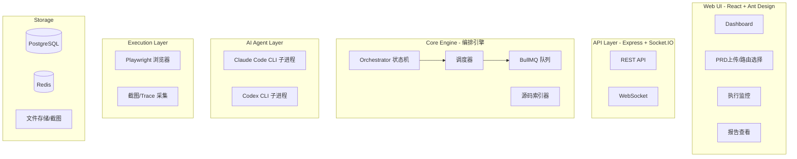

# PRD-Based UI Testing Agent System - 技术设计方案 (v6 - Review 三轮修正)

## Context

团队已建立 PRD → Claude Code 开发 → Codex Review 的开发流程，现需补齐测试环节。
构建可复用的 AI 测试 Agent 系统，基于 Playwright 实现 PRD → 测试用例生成 → UI 自动化执行 → AI 交叉审核 → 缺陷报告的完整闭环。

- **目标用户：** 团队内部，Web 服务 + UI
- **目标项目：** Java (Spring Boot) + Vue/React (Ant Design)
- **AI 协作：** Claude Code 执行 + Codex 审核
- **修复策略：** 只报告不修复（MVP 为现象级缺陷报告；Phase 3 加入源码定位 + 根因分析 + 修复建议）
- **部署模式：** 目标服务 IP/端口可配置，前端源码在本地同机
- **测试方式：** 基于 Playwright 的 UI 自动化测试（源码辅助生成）

---

## 0. Review 结论与收敛决策

### 0.1 核心判断

方案方向正确，可落地。**MVP 选择 UI 测试而非 API 测试**，原因：
- 业务逻辑复杂，API 层造数链路长、数据依赖多，成本高
- 系统已有真实业务数据，登录后通过 UI 查询/操作即可验证
- 查询类操作天然只读，不需要造数和清理
- 提供前端源码（路由表 + 页面组件）可大幅提升 Playwright 脚本准确率

### 0.2 已识别风险与处置

| # | 风险 | 处置决策 |
|---|------|---------|
| R1 | 状态机过重，MVP 引入过多异常态 | MVP 收敛到 8 个核心态，异常统一为 `failed` + `reason_code` |
| R2 | 交叉验证 agree/disagree 太粗，不支撑自动决策 | 每条 assertion 必须输出判定依据（evidence + 截图），冲突时转人工 |
| R3 | 质量门禁缺采集口径、计算时机、失败处置 | 补充完整定义，MVP 启用 RC/APR；FR 需 ≥3 次历史后自动启用 |
| R4 | Playwright 选择器不稳定 | 源码辅助生成 + 选择器优先级约束 + 每步截图（见 1.2, 1.3） |
| R5 | AI 上下文过大导致生成质量下降 | 源码裁剪策略：只给路由表 + 被测页面组件 + API 定义（见 1.3） |
| R6 | manifest.json 缺少环境指纹，报告难追责 | 新增 `env_fingerprint` 字段（见 5.2） |

### 0.3 MVP 收敛范围

- **UI 查询测试链路**：登录 → 导航到目标页面 → 执行查询/浏览操作 → 验证页面展示 → 报告
- **源码辅助生成**：提供前端路由表 + 被测页面源码，AI 生成精准的 Playwright 脚本
- **MVP 以只读操作为主**：查询、列表浏览、详情查看、搜索筛选
- **写操作（表单提交/创建/删除）放 Phase 2**
- **人工审批点只保留一个**：用例生成后审批，其余环节自动执行
- **报告产出后增加人工确认环节**（非审批，是确认发布）

### 0.4 开工前必须先定的 3 件事

1. **requirements.json schema** — 含优先级、可测性标签、验收标准（见第 12 节）
2. **execution-results.json assertion 粒度** — 每条 assertion 含截图 + 操作步骤链（见第 13 节）
3. **人工介入规则** — MVP 阶段只保留一条：双 agent 结论冲突 → 人工（见 7.2）

---

## 1. 整体流程

```
用户指定被测页面路由（或上传 PRD）
  → Step 0: 系统定位前端源码（路由表 → 页面组件 → API 定义）
  → Step 1: Claude Code 解析 PRD + 源码 → 生成 Playwright 测试用例 → Codex 审核
    → 人工审批测试计划（唯一审批点）
  → Step 2: Claude Code 通过 Playwright 执行 UI 测试（每步截图）
  → Step 3: Codex 审核执行结果（截图 + 断言，误报/漏报检测）
  → Step 4: 发现缺陷 → 生成缺陷报告（MVP 不含源码深挖，Phase 3 加入）
  → Step 5: 质量门禁检查 → 生成最终测试报告 → 人工确认发布
```

### 1.1 测试对象配置（Target Profile）

每个项目必须配置 target profile，约束 AI 测试的能力边界。

```json
{
  "target_profile": {
    "base_url": "http://192.168.1.100:8080",
    "login": {
      "login_url": "/login",
      "username_field": "用户名",
      "password_field": "密码",
      "submit_button": "登录",
      "credentials": { "username": "$TEST_USERNAME", "password": "$TEST_PASSWORD" },
      "success_indicator": "/dashboard"
    },
    "allowed_routes": ["/system/user", "/system/role", "/order/list"],
    "denied_routes": ["/system/config", "/monitor/*"],
    "allowed_operations": ["query", "view_detail", "search", "filter", "paginate"],
    "denied_operations": ["create", "delete", "batch_delete"],
    "source_code": {
      "frontend_root": "/path/to/frontend/src",
      "router_file": "router/index.ts",
      "page_dir": "views/",
      "api_dir": "api/"
    },
    "browser": {
      "viewport": { "width": 1920, "height": 1080 },
      "locale": "zh-CN",
      "timeout_ms": 30000
    }
  }
}
```

**字段说明：**

| 字段 | 必填 | 说明 |
|------|------|------|
| `base_url` | 是 | 目标服务地址 |
| `login` | 是 | 登录配置：页面路径、表单字段文本、凭证引用、登录成功后的跳转路径。**凭证禁止明文存储**，使用环境变量引用（如 `$TEST_PASSWORD`） |
| `allowed_routes` | 是 | 允许测试的页面路由（白名单） |
| `denied_routes` | 否 | 禁止访问的路由（黑名单，双重保险） |
| `allowed_operations` | 是 | MVP 允许的操作类型（只读为主） |
| `denied_operations` | 否 | 禁止的操作类型 |
| `source_code` | 是 | 前端源码路径配置，用于源码辅助生成 |
| `browser` | 否 | 浏览器配置（视口、语言、超时） |

### 1.2 Playwright 选择器策略

为保证 UI 测试稳定性，prompt 中约束 AI 生成的选择器必须遵循以下优先级：

```
优先级从高到低：
1. getByRole('button', { name: '查询' })     ← 最稳定，基于语义角色 + 可见文本
2. getByText('用户管理')                       ← 基于可见文本
3. getByPlaceholder('请输入用户名')             ← 基于 placeholder
4. getByLabel('用户名')                        ← 基于 label 关联
5. getByTestId('user-search-btn')             ← 基于 data-testid（需源码中存在）
6. locator('.ant-table-row')                  ← CSS 选择器（最后手段，仅用于 Ant Design 结构性元素）
```

**禁止使用：**
- 动态生成的 class name（如 `css-1a2b3c`、`ant-btn-xxx` 带哈希的）
- XPath（维护成本高）
- `:nth-child()` 精确索引（页面数据变化会失效）

### 1.3 源码辅助生成机制

AI 生成 Playwright 脚本前，系统自动从前端源码中提取上下文：

```
用户指定被测路由（如 /system/user）
  → 解析路由表（router/index.ts）→ 找到对应组件文件路径
  → 读取页面组件（views/system/user/index.vue）
  → 提取页面中引用的 API 文件（api/system/user.ts）
  → 将 3 个文件作为上下文传给 Claude Code
```

**传给 AI 的上下文（每次 3-5 个文件）：**

| 文件类型 | 用途 | 提取信息 |
|---------|------|---------|
| 路由表 | 知道所有页面路径和菜单结构 | 路由 path、组件映射、菜单层级 |
| 页面组件 | 知道页面上有什么元素 | 按钮文本、表单字段、表格列定义、搜索条件 |
| API 定义 | 知道接口参数和返回结构 | 请求参数、响应字段（用于验证页面展示是否正确） |

**上下文裁剪规则：**
- 只给被测页面相关文件，不给整个项目
- 公共组件（Layout、Header 等）不传，除非被测页面直接依赖
- 单个文件超过 500 行时，只提取 `<template>` 和关键 `<script>` 部分

## 2. 角色分工与详细流程

### 2.1 角色总览

| 角色 | 职责 | 每次 run 介入次数 |
|------|------|-----------------|
| **人工** | ① 一次性配置 target profile ② 上传 PRD + 指定路由 ③ 审批测试用例 ④ 冲突时裁决 ⑤ 确认发布报告 | 2-3 次（无冲突时） |
| **Claude Code** | ① 解析 PRD + 源码 → 生成用例 ② 执行 Playwright 测试 ③ 生成缺陷报告 | 全自动，3 个阶段 |
| **Codex** | ① 审核用例质量 ② 审核执行结果 | 全自动，2 个阶段 |
| **系统（编排引擎）** | ① 源码定位 ② 状态机流转 ③ 质量门禁计算 ④ 截图/trace 管理 | 全自动，贯穿全程 |

### 2.2 分步详细流程

#### Phase 0: 项目配置（人工，一次性）

```
👤 人工操作：
  1. 配置 target-profile.json
     - 填写目标服务地址（base_url）
     - 填写登录凭证（用户名/密码）
     - 指定允许测试的路由列表（allowed_routes）
     - 指定允许的操作类型（query/view_detail/search 等）
     - 配置前端源码路径（router_file / page_dir / api_dir）
  2. 上传/指定 PRD 文档（Markdown）
  3. 指定本次要测试的页面路由（如 /system/user, /order/list）
```

#### Step 0: 源码定位（系统自动）

```
⚙️ 系统自动：
  解析路由表（router/index.ts）
    → 根据被测路由找到对应的页面组件文件（如 views/system/user/index.vue）
    → 提取页面中引用的 API 文件（如 api/system/user.ts）
    → 输出：source-context/ 目录（3-5 个文件）
```

#### Step 1: 解析 PRD + 生成测试用例

```
🤖 Claude Code：
  输入：PRD 原文 + 路由表 + 页面组件源码 + API 定义
  操作：解析 PRD，结合源码中的按钮文本/表单字段/表格列，生成 Playwright 测试用例
  输出：requirements.json + test-cases.json（含具体的 Playwright 操作步骤和选择器）

🤖 Codex：
  输入：requirements.json + test-cases.json + PRD 原文
  操作：审核用例质量——覆盖率是否足够、选择器是否稳定、有无遗漏场景
  输出：codex-review-tc.json（审核意见）
```

```
┌─────────────────────────────────────────────────────────┐
│  👤 人工审批（唯一审批点）                                  │
│                                                         │
│  查看内容：                                               │
│  - 生成的测试用例列表和操作步骤                              │
│  - Codex 的审核意见                                       │
│  - 选择器策略是否合理                                      │
│                                                         │
│  决策：✅ 批准执行  /  ❌ 打回修改                           │
└─────────────────────────────────────────────────────────┘
```

#### Step 2: 执行 UI 测试（全自动）

```
🤖 Claude Code：
  输入：已审批的 test-cases.json + target-profile.json
  操作：
    1. 启动 Playwright 浏览器
    2. 登录目标系统（按 target profile 中的登录配置）
    3. 按路由导航到被测页面
    4. 执行操作（点击查询、输入搜索条件、切换分页等）
    5. 每一步自动截图
    6. 执行断言（检查表格是否有数据、页面标题是否正确等）
  输出：execution-results.json + evidence/screenshots/ + evidence/traces/

🤖 Codex：不参与
👤 人工：不参与
```

#### Step 3: 审核执行结果（全自动）

```
🤖 Claude Code：不参与

🤖 Codex：
  输入：test-cases.json + execution-results.json + 截图 + PRD 原文
  操作：
    - 逐条审核断言结果
    - 检查截图是否与断言一致（误报检测）
    - 检查是否有遗漏的验证点（漏报检测）
  输出：codex-review-results.json（每条断言的审核意见：agree / disagree / uncertain）
```

```
┌─────────────────────────────────────────────────────────┐
│  ⚙️ 交叉验证裁决（自动）                                   │
│                                                         │
│  Claude Code pass + Codex agree    → ✅ pass             │
│  Claude Code fail + Codex agree    → ❌ fail             │
│  Codex uncertain                   → 👤 转人工判定        │
│  双方不一致                         → 👤 转人工判定        │
│                          （状态 → failed, agent_conflict）│
└─────────────────────────────────────────────────────────┘
```

#### Step 4: 生成缺陷报告（全自动）

```
🤖 Claude Code：
  输入：execution-results.json + codex-review-results.json
  操作：汇总所有 fail 的断言，生成缺陷报告
  输出：final-report.json（含缺陷列表、截图、操作步骤回放）

  注：MVP 不含源码深挖，Phase 3 才加入根因分析和修复建议
```

#### Step 5: 质量门禁 + 人工确认

```
⚙️ 系统自动：
  - 计算 RC（需求覆盖率）→ 不达标则阻断
  - 计算 APR（断言通过率）→ 不达标仅告警
  - 计算 FR（用例不稳定率）→ 需 ≥3 次历史数据，不足则跳过
  - 生成最终报告
```

```
┌─────────────────────────────────────────────────────────┐
│  👤 人工确认发布                                          │
│                                                         │
│  查看内容：                                               │
│  - 最终报告和缺陷列表                                     │
│  - 失败用例的截图和操作步骤                                 │
│  - 门禁指标是否达标                                       │
│                                                         │
│  决策：✅ 确认发布报告  /  🔄 标记需要重测                   │
└─────────────────────────────────────────────────────────┘
```

### 2.3 分工矩阵

| | 系统（编排引擎） | Claude Code | Codex | 人工 |
|---|---|---|---|---|
| Phase 0 配置 | | | | ✅ 配置 target profile |
| Step 0 源码定位 | ✅ 解析路由表 | | | |
| Step 1 生成用例 | | ✅ 解析 PRD + 生成用例 | ✅ 审核用例质量 | ✅ **审批** |
| Step 2 执行测试 | | ✅ Playwright 执行 | | |
| Step 3 审核结果 | ✅ 交叉验证裁决 | | ✅ 审核执行结果 | ⚠️ 冲突时介入 |
| Step 4 生成报告 | | ✅ 汇总缺陷报告 | | |
| Step 5 门禁+发布 | ✅ 计算门禁指标 | | | ✅ **确认发布** |

两者不直接对话，通过编排引擎中转（JSON 文件传递上下文）。

## 3. 系统架构



**技术栈：** TypeScript (Node.js) / Express + tRPC / React 18 + Ant Design 5 / PostgreSQL + Prisma / Redis + BullMQ / Socket.IO / Playwright / Turborepo + pnpm

## 4. 状态机设计

### 4.1 MVP 核心状态（8 态）

```
created → parsing → generating → awaiting_approval → executing → codex_reviewing → report_ready → completed
                                                                                                  ↘ failed
```

- `created` — 任务创建，PRD 已上传或路由已指定
- `parsing` — Claude Code 解析 PRD，提取需求（源码定位已在 Step 0 由编排引擎完成）
- `generating` — Claude Code 生成 Playwright 测试用例 + Codex 审核用例质量
- `awaiting_approval` — 等待人工审批测试计划（唯一审批点）
- `executing` — Claude Code 通过 Playwright 执行 UI 测试（每步截图）
- `codex_reviewing` — Codex 审核执行结果（截图 + 断言）
- `report_ready` — 报告已生成，等待人工确认发布
- `completed` — 流程结束

**终态：** `completed` / `failed`（MVP 中 failed 为真终态，恢复需新建 run；Phase 2 引入从 failed 恢复机制）

**异常处理：** MVP 阶段所有异常统一进入 `failed` 状态，通过 `reason_code` 区分：

| reason_code | 含义 | 处置 |
|-------------|------|------|
| `retry_exhausted` | 可重试错误（网络/限流）重试耗尽 | 人工检查环境后重新发起 |
| `agent_timeout` | AI agent 响应超时 | 检查 CLI 状态后重试 |
| `approval_timeout` | 人工审批超时（默认 24h） | 重新发起或取消 |
| `agent_conflict` | 双 agent 结论冲突且无法自动裁决 | 人工判定冲突原因后，手动新建 run 重跑（系统不会自动重跑） |
| `playwright_error` | Playwright 执行异常（元素未找到/超时/页面崩溃） | 检查选择器和页面状态后重试 |
| `internal_error` | 系统内部错误 | 查日志修复后重试 |

### 4.2 后续扩展状态（Phase 2+）

Phase 2 及以后根据需要拆分：
- `failed` 中的 `retry_exhausted` → 独立 `retrying` 状态（自动重试循环）
- `failed` 中的 `agent_conflict` → 独立 `manual_intervention` 状态
- 新增 `analyzing_defects` 状态（Phase 3 源码定位）

### 4.3 幂等性

- 每个 job 的幂等键：`run_id + state + shard_id`
- 重复进入同一状态 = no-op，防止 worker 重启导致重复执行

## 5. 工作空间与上下文传递

### 5.1 目录结构

```
.ai-test-workspace/{run_id}/
├── manifest.json              ← 根索引（含环境指纹）
├── target-profile.json        ← 测试对象配置
├── source-context/            ← 源码上下文（自动提取）
│   ├── router.ts              # 路由表摘要
│   ├── page-{route}.vue       # 被测页面组件
│   └── api-{route}.ts         # 对应 API 定义
├── prd-parsed.json
├── requirements.json
├── test-cases.json            # 含 Playwright 脚本
├── codex-review-tc.json
├── execution-results.json
├── codex-review-results.json
├── evidence/                  # 截图、trace、视频
│   ├── screenshots/           # 每步截图 {case_id}-step-{n}.png
│   ├── traces/                # Playwright trace 文件
│   └── videos/                # 失败用例录屏（可选）
└── final-report.json
```

### 5.2 manifest.json

记录运行元数据，用于审计追溯：
- `run_id` / `project_id` / `status`
- `agent_versions`：Claude Code 和 Codex 的版本号
- `prompt_versions`：各 Prompt 模板版本
- `artifacts`：所有产物文件的 SHA256 校验和
- `decision_log`：人工决策记录（谁、何时、批准了什么）
- `env_fingerprint`：环境指纹，用于结果追溯和复现

```json
{
  "env_fingerprint": {
    "service_version": "v2.1.0",
    "git_commit": "a1b2c3d",
    "frontend_commit": "b2c3d4e",
    "config_hash": "sha256:e4f5...",
    "target_url": "http://192.168.1.100:8080",
    "browser_version": "chromium 120.0",
    "captured_at": "2024-01-01T10:00:00Z"
  }
}
```

环境指纹在 run 启动时自动采集。如果目标服务提供 `/health` 或 `/version` 端点，优先从接口获取；否则从项目 git 信息读取。

## 6. CLI 集成

### 6.1 能力探测与降级

启动时探测 `claude --help` / `codex --help`，构建能力映射：
- `supports_stream_json` / `supports_allowed_tools` / `supports_suggest_mode`
- 不支持的功能自动降级，降级决策写入 `manifest.json`

**降级矩阵（MVP）：**

| 能力 | 正常模式 | 降级模式 | 影响 |
|------|---------|---------|------|
| `stream-json` | `--output-format stream-json` | `--output-format json`，轮询读取 | 失去实时进度，功能不受影响 |
| `allowed-tools` | `--allowedTools mcp__playwright__*,Bash,Read` | 不限制工具，prompt 中约束 | 安全性降低，需人工关注 |
| `suggest-mode` | `--approval-mode suggest` | 只读 prompt + 人工审核结果 | Codex 审核变为纯文本输出，人工解读 |

### 6.2 调用方式

```typescript
// Claude Code — UI 测试执行模式
spawn('claude', ['--print', prompt, '--output-format', 'stream-json',
  '--max-turns', '30', '--allowedTools', 'mcp__playwright__*,Bash,Read']);

// Codex — 审核模式（只读，传入截图路径供审核）
spawn('codex', ['--prompt', reviewPrompt, '--approval-mode', 'suggest']);
```

### 6.3 Prompt 模板（4 套）

| Prompt | 用途 | 输入 | 输出 |
|--------|------|------|------|
| `prd-parse.md` | PRD 解析 + UI 测试用例生成 | PRD 原文 + 路由表 + 页面源码 + API 定义 | requirements.json + test-cases.json（含 Playwright 步骤） |
| `ui-test-execute.md` | Playwright UI 测试执行 | 测试用例 + target profile | execution-results.json + 截图 + trace |
| `review-results.md` | Codex 审核 | 用例 + 执行结果 + 截图 + PRD | codex-review-results.json |
| `defect-analyze.md` | 缺陷源码定位（Phase 3） | 缺陷信息 + 源码路径 + Codex 意见 | defect-analysis.json |

## 7. 交叉验证与共识机制

### 7.1 判定字段说明

Claude Code 执行层和 Codex 审核层使用**两套独立的判定字段**：

| 字段 | 所属 | 枚举值 | 含义 |
|------|------|--------|------|
| `machine_verdict` | execution-results.json | `pass` / `fail` / `error` | 程序自动比对结果 |
| `agent_verdict` | execution-results.json | `pass` / `fail` / `error` | Claude Code 的 AI 判定 |
| `review_verdict` | codex-review-results.json | `agree` / `disagree` / `uncertain` | Codex 对 Claude Code 判定的审核意见 |

### 7.2 判定矩阵

| Claude Code 判定 | Codex 判定 | 最终结果 |
|---|---|---|
| pass | agree | **pass** |
| fail | agree | **fail** |
| pass | disagree | **转人工**（状态 → `failed`, reason_code = `agent_conflict`） |
| fail | disagree | **转人工**（状态 → `failed`, reason_code = `agent_conflict`） |
| pass/fail | uncertain | **转人工**（状态 → `failed`, reason_code = `agent_conflict`） |

### 7.3 人工介入规则（MVP）

MVP 阶段只保留一条自动触发规则：

- **双 agent 结论冲突 → 转人工判定**

冲突发生时记录 `conflict_type`，用于后续分析和策略优化：

| conflict_type | 含义 | MVP 处置 | 后续可优化为 |
|---------------|------|---------|-------------|
| `fact_conflict` | 事实判定不一致（pass vs fail） | 人工判定 | 自动重跑一次后再判 |
| `evidence_missing` | 一方认为截图/证据不足 | 人工判定 | 自动补充截图后重审 |
| `threshold_conflict` | 对 UI 展示/布局判定不一致 | 人工判定 | 按预设规则自动裁决 |

以下规则暂不启用，待有历史数据后再校准：
- ~~confidence 低于阈值（如 0.7）~~ — AI 自报 confidence 可靠性有限，MVP 不依赖此值做自动决策


### 7.4 术语定义

| 术语 | 含义 |
|------|------|
| **审批（approval）** | 人工对测试计划的正式批准，阻断式，不批准则不执行。仅在用例生成后触发 |
| **确认（confirm）** | 人工对测试报告的发布确认，**阻断式**，确认前报告不对外可见。与审批的区别：审批是对计划的批准，确认是对结果的认可 |
| **裁决（arbitrate）** | 人工对双 agent 冲突的判定，按需触发 |

### 7.5 assertion 级判定要求

每条 assertion 的判定结果必须包含：

```json
{
  "assertion_id": "REQ-001-TC-001-A-001",
  "type": "element_visible",
  "description": "用户列表表格应显示数据",
  "expected": "表格行数 > 0",
  "actual": "表格显示 10 行数据",
  "machine_verdict": "pass",
  "agent_verdict": "pass",
  "evidence": {
    "screenshot_before": "evidence/screenshots/REQ-001-TC-001-step-2.png",
    "screenshot_after": "evidence/screenshots/REQ-001-TC-001-step-3.png",
    "page_url": "/system/user",
    "operation_steps": [
      { "step": 1, "action": "navigate", "target": "/system/user" },
      { "step": 2, "action": "click", "target": "getByRole('button', { name: '查询' })" },
      { "step": 3, "action": "assert", "target": "表格行数 > 0" }
    ],
    "trace_path": "evidence/traces/REQ-001-TC-001.zip"
  },
  "agent_reasoning": "点击查询按钮后，表格成功加载并显示 10 行用户数据"
}
```

## 8. 缺陷分析与报告（替代自动修复）

当 Codex 审核确认存在缺陷后，Claude Code 读取本地源码进行深度分析（Phase 3）：

- **源码定位**：Claude Code 读取页面组件 / API 定义 / Controller/Service 等代码，定位缺陷根因
- **报告内容**：每个缺陷包含——问题描述、影响范围、根因分析、涉及的源码文件和行号、修复建议、相关截图
- **严重程度**：critical / major / minor / suggestion
- **不修改代码**：系统只读取源码，不做任何写入操作
- 人工或开发者拿到报告后自行修复

## 9. 质量门禁指标

### 9.1 门禁指标定义（按 Phase 启用）

| 指标 | 启用 Phase | 公式 | 门禁值 | 采集口径 | 计算时机 | 失败处置 |
|------|-----------|------|--------|---------|---------|---------|
| 需求覆盖率 RC | **Phase 1** | covered_reqs / total_reqs | ≥ 0.85（P0 = 1.00） | requirements.json 中 `testable=true` 的需求 | 用例生成后、执行前 | 阻断：补充用例后重新审批 |
| 断言通过率 APR | **Phase 1** | passed / executed | ≥ 0.95 | execution-results.json 中所有确定性 assertion | 测试执行完成后 | 告警：标记未达标，不阻断报告生成 |
| 用例不稳定率 FR | **Phase 2** | flaky / automated | ≤ 0.05 | 同一用例连续 3 次执行结果不一致标记为 flaky | 需 ≥3 次执行历史，不足则跳过 | 告警：标记 flaky 用例，建议人工复核 |

### 9.2 后续指标（Phase 3+，需历史数据）

| 指标 | 公式 | 门禁值 | 启用条件 |
|------|------|--------|---------|
| 缺陷检测精度 DDP | true_positive / all_reported | ≥ 0.70 | 需人工标注 ≥50 条缺陷的真阳性数据 |
| 缺陷逃逸率 DER | post_release / test_scope | ≤ 0.10 | 需接入线上缺陷追踪系统 |

### 9.3 追溯链路

`requirement_id → case_id → assertion_id → evidence（截图 + 操作步骤）` 四层 ID 必填，缺失任一层级视为数据不完整，不纳入门禁计算。

### 9.4 结果可复现性

断言分为两类，复现性要求不同：

| 断言类型 | 判定方式 | 复现性要求 | 示例 |
|---------|---------|-----------|------|
| **确定性断言** | `machine_verdict`（程序比对） | 同环境下 100% 可复现 | 表格行数 > 0、按钮文本 == "查询"、页面标题包含"用户管理" |
| **AI 判定断言** | `agent_verdict`（AI 语义判断） | 标记为 `soft_assertion`，不要求严格复现 | "页面布局合理"、"错误提示信息对用户友好" |

- 确定性断言结果不一致时，视为环境问题或代码变更，需排查
- AI 判定断言仅作为参考，不纳入 APR 计算，不作为门禁阻断依据

## 10. 分阶段实施

| Phase | 目标 | 核心内容 |
|-------|------|---------|
| **Phase 1 MVP** | 跑通 UI 查询测试链路 | Claude Code/Codex CLI 封装 + 源码索引器 + PRD 解析 + Playwright UI 测试（只读操作）+ Codex 结果审核 + 8 态状态机 + manifest.json + 基础 UI（项目配置 + 路由选择）+ 截图报告 + 人工确认发布 + 质量门禁（RC/APR） |
| **Phase 2** | 写操作 + 稳定性 | 表单提交/创建/编辑测试 + 测试数据管理（造数+清理）+ FR 指标启用 + failed 恢复机制 + WebSocket 实时推送 + 审批 SLA |
| **Phase 3** | 缺陷深挖 + 完整报告 | 源码定位分析 + 缺陷报告（含根因 + 修复建议）+ HTML/PDF 报告 + BullMQ 队列 + 高级门禁（DDP/DER）+ 状态机扩展 |
| **Phase 4** | 优化扩展 | 并行执行 + 历史分析 + Docker 部署 + CI/CD 集成 + Prompt 版本管理 |

## 11. 验证方案

端到端：创建项目 → 配置 target profile → 指定被测路由 → 解析源码 → 生成用例 → 审批 → Playwright 执行 → Codex 审核 → 报告 → 人工确认

验收指标：P0 覆盖率 = 1.00 / 总体 RC ≥ 0.85 / APR ≥ 0.95 / 零未知状态转换

---

## 12. Schema 定义：requirements.json

PRD 解析后的结构化需求，是整个链路的源头。

```json
{
  "run_id": "run-20240101-001",
  "prd_source": "prd-v1.2.md",
  "tested_routes": ["/system/user"],
  "requirements": [
    {
      "requirement_id": "REQ-001",
      "title": "用户管理列表页查询功能",
      "description": "用户管理页面支持按用户名、手机号、状态筛选查询",
      "priority": "P0",
      "testable": true,
      "route": "/system/user",
      "acceptance_criteria": [
        "页面加载后默认显示用户列表",
        "输入用户名点击查询，表格按用户名筛选",
        "点击重置按钮，清空搜索条件并重新加载列表",
        "切换分页，表格数据正确更新"
      ],
      "source_section": "PRD 3.1 用户管理",
      "tags": ["ui", "query", "user"]
    }
  ]
}
```

**字段说明：**

| 字段 | 类型 | 必填 | 说明 |
|------|------|------|------|
| `requirement_id` | string | 是 | 全局唯一，格式 `REQ-{序号}` |
| `title` | string | 是 | 需求简述 |
| `description` | string | 是 | 需求详细描述 |
| `priority` | enum | 是 | `P0` / `P1` / `P2`，P0 必须 100% 覆盖 |
| `testable` | boolean | 是 | AI 判断是否可 UI 自动化测试 |
| `route` | string | 是 | 对应的前端路由路径 |
| `acceptance_criteria` | string[] | 是 | 验收标准，保持自然语言，每条对应一个或多个 test case |
| `source_section` | string | 否 | PRD 中的来源章节，用于追溯 |
| `tags` | string[] | 否 | 分类标签（ui/query/form/detail 等） |

## 13. Schema 定义：execution-results.json

测试执行结果，包含 Playwright 操作步骤链和截图。

```json
{
  "run_id": "run-20240101-001",
  "environment": {
    "target_url": "http://192.168.1.100:8080",
    "browser": "chromium 120.0",
    "viewport": "1920x1080"
  },
  "summary": {
    "total_cases": 5,
    "total_assertions": 12,
    "passed": 11,
    "failed": 1,
    "skipped": 0
  },
  "test_cases": [
    {
      "case_id": "REQ-001-TC-001",
      "requirement_id": "REQ-001",
      "route": "/system/user",
      "title": "用户列表页默认加载",
      "status": "passed",
      "steps": [
        {
          "step": 1,
          "action": "navigate",
          "target": "/system/user",
          "screenshot": "evidence/screenshots/REQ-001-TC-001-step-1.png",
          "duration_ms": 1200
        },
        {
          "step": 2,
          "action": "wait",
          "target": "getByRole('table')",
          "screenshot": "evidence/screenshots/REQ-001-TC-001-step-2.png",
          "duration_ms": 800
        }
      ],
      "assertions": [
        {
          "assertion_id": "REQ-001-TC-001-A-001",
          "type": "element_visible",
          "description": "用户列表表格应显示",
          "expected": "表格可见且行数 > 0",
          "actual": "表格可见，显示 10 行",
          "machine_verdict": "pass",
          "agent_verdict": "pass",
          "evidence": {
            "screenshot": "evidence/screenshots/REQ-001-TC-001-step-2.png",
            "page_url": "/system/user",
            "trace_path": "evidence/traces/REQ-001-TC-001.zip"
          },
          "agent_reasoning": "表格正常渲染，显示 10 行用户数据，分页器显示共 50 条"
        }
      ]
    }
  ]
}
```

**assertion 字段说明：**

| 字段 | 类型 | 必填 | 说明 |
|------|------|------|------|
| `assertion_id` | string | 是 | 格式 `{case_id}-A-{序号}`，全局唯一 |
| `type` | enum | 是 | `element_visible` / `text_content` / `element_count` / `navigation` / `soft`（AI 判定） |
| `description` | string | 是 | 断言描述 |
| `expected` | string | 是 | 预期结果 |
| `actual` | string | 是 | 实际结果 |
| `machine_verdict` | enum | 是 | `pass` / `fail` / `error`，程序自动比对结果 |
| `agent_verdict` | enum | 是 | `pass` / `fail` / `error`，AI agent 判定结果 |
| `evidence.screenshot` | string | 是 | 断言时刻的截图路径 |
| `evidence.page_url` | string | 是 | 当前页面相对路径（如 `/system/user`，base_url 在 environment 中） |
| `evidence.trace_path` | string | 否 | Playwright trace 文件路径 |
| `agent_reasoning` | string | 是 | AI 判定依据，Codex 审核时的关键输入 |

**ID 命名规范：**

```
requirement_id:  REQ-{3位序号}              → REQ-001
case_id:         REQ-{序号}-TC-{3位序号}     → REQ-001-TC-001
assertion_id:    REQ-{序号}-TC-{序号}-A-{3位序号} → REQ-001-TC-001-A-001
```

## 14. Schema 定义：test-cases.json

Claude Code 生成的测试用例，含 Playwright 操作步骤，是执行阶段的输入。

```json
{
  "run_id": "run-20240101-001",
  "test_cases": [
    {
      "case_id": "REQ-001-TC-001",
      "requirement_id": "REQ-001",
      "route": "/system/user",
      "title": "用户列表页默认加载显示数据",
      "precondition": "已登录系统",
      "steps": [
        {
          "step": 1,
          "action": "navigate",
          "target": "/system/user",
          "description": "导航到用户管理页面"
        },
        {
          "step": 2,
          "action": "wait",
          "target": "getByRole('table')",
          "description": "等待表格加载完成"
        }
      ],
      "assertions": [
        {
          "assertion_id": "REQ-001-TC-001-A-001",
          "type": "element_visible",
          "description": "用户列表表格应显示",
          "expected": "表格可见且行数 > 0",
          "selector": "getByRole('table')"
        }
      ],
      "tags": ["query", "default_load"]
    }
  ]
}
```

**字段说明：**

| 字段 | 类型 | 必填 | 说明 |
|------|------|------|------|
| `case_id` | string | 是 | 格式 `REQ-{序号}-TC-{序号}` |
| `requirement_id` | string | 是 | 关联的需求 ID |
| `route` | string | 是 | 被测页面路由 |
| `title` | string | 是 | 用例标题 |
| `precondition` | string | 是 | 前置条件（如"已登录系统"） |
| `steps[].action` | enum | 是 | `navigate` / `click` / `fill` / `wait` / `assert` / `screenshot` |
| `steps[].target` | string | 是 | 操作目标（路由路径或 Playwright 选择器） |
| `steps[].description` | string | 是 | 步骤描述 |
| `assertions[].type` | enum | 是 | `element_visible` / `text_content` / `element_count` / `navigation` / `soft` |
| `assertions[].selector` | string | 否 | 断言关联的选择器 |

## 15. Schema 定义：codex-review-results.json

Codex 对执行结果的审核意见，是交叉验证的核心输入。同样适用于 `codex-review-tc.json`（用例审核），结构一致。

```json
{
  "run_id": "run-20240101-001",
  "review_type": "execution_results",
  "reviewed_at": "2024-01-01T11:00:00Z",
  "summary": {
    "total_reviewed": 12,
    "agree": 11,
    "disagree": 1,
    "uncertain": 0
  },
  "reviews": [
    {
      "subject_id": "REQ-001-TC-001-A-001",
      "subject_type": "assertion",
      "original_verdict": "pass",
      "review_verdict": "agree",
      "conflict_type": null,
      "reasoning": "截图确认表格已正常渲染，数据行数与断言一致",
      "suggestions": null
    },
    {
      "subject_id": "REQ-001-TC-002-A-001",
      "subject_type": "assertion",
      "original_verdict": "pass",
      "review_verdict": "disagree",
      "conflict_type": "fact_conflict",
      "reasoning": "截图显示表格为空，但断言判定为 pass，疑似等待时间不足导致截图时机过早",
      "suggestions": "建议增加 waitForSelector 等待表格数据加载完成后再截图"
    }
  ]
}
```

**字段说明：**

| 字段 | 类型 | 必填 | 说明 |
|------|------|------|------|
| `review_type` | enum | 是 | `test_cases`（用例审核）/ `execution_results`（结果审核） |
| `reviews[].subject_id` | string | 是 | 被审核对象的 ID：结果审核时为 assertion_id，用例审核时为 case_id |
| `reviews[].subject_type` | enum | 是 | `assertion`（结果审核）/ `case`（用例审核） |
| `reviews[].original_verdict` | enum \| null | 条件必填 | Claude Code 的原始判定：`pass` / `fail` / `error`。**结果审核时必填，用例审核时为 null**（用例阶段尚未执行） |
| `reviews[].review_verdict` | enum | 是 | Codex 审核意见：`agree` / `disagree` / `uncertain` |
| `reviews[].conflict_type` | enum | 否 | 冲突类型（仅 disagree 时）：`fact_conflict` / `evidence_missing` / `threshold_conflict` |
| `reviews[].reasoning` | string | 是 | 审核依据 |
| `reviews[].suggestions` | string | 否 | 改进建议（仅 disagree/uncertain 时） |

## 16. 已拍板决策

| # | 决策项 | 结论 | 理由 |
|---|--------|------|------|
| D1 | MVP 测试类型 | **UI 测试（Playwright）** | 业务数据复杂，API 造数成本高；UI 查询操作只读，利用已有数据即可 |
| D2 | 脚本生成方式 | **源码辅助生成** | 提供路由表 + 页面组件 + API 定义，AI 生成的选择器和断言更准确 |
| D3 | MVP 操作范围 | **只读操作为主** | 查询/浏览/搜索/筛选/分页，写操作放 Phase 2 |
| D4 | 人工审批保留几个节点 | **审批 1 个 + 确认 1 个** | 用例生成后审批，报告产出后确认发布 |
| D5 | 冲突时默认策略 | **MVP 直接人工，不自动重跑** | 自动重跑需先定义"什么条件下重跑有意义"，MVP 无此数据 |
| D6 | 门禁失败是否阻断 | **RC 阻断，APR/FR 仅告警** | 覆盖率不达标必须补用例；通过率/稳定率可能是环境问题 |

## 17. 待讨论事项

- [ ] 源码索引器是自动解析路由表，还是需要人工维护路由→源码映射？
- [ ] Playwright 执行失败（元素未找到）时，是否自动尝试备选选择器？
- [ ] 截图存储策略：全部保留还是只保留失败用例的截图？
- [ ] MVP 阶段 Codex 审核是否每次都触发，还是只在 fail 时触发（节省 API 调用）？
- [ ] 报告人工确认环节的具体交互形式（UI 按钮 / CLI 命令 / 邮件通知）？
- [ ] 是否需要支持 Playwright trace viewer 在线查看？
